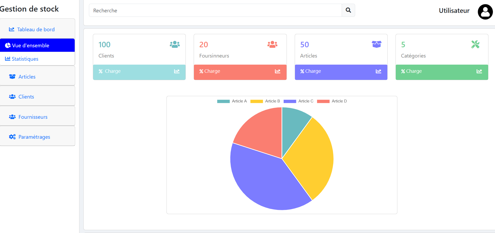
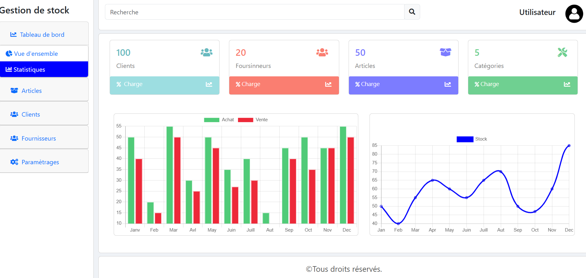
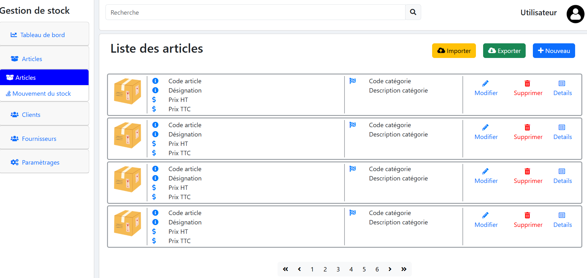
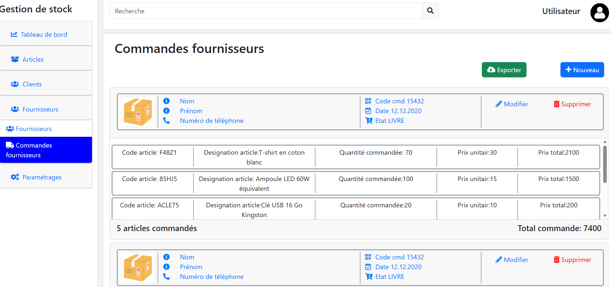
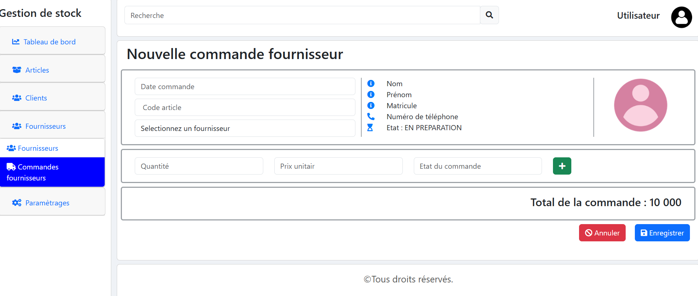
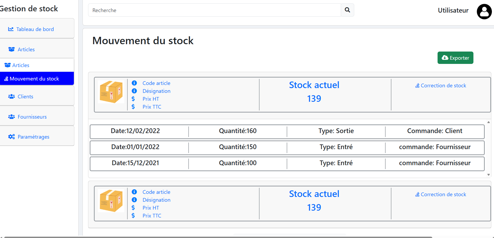
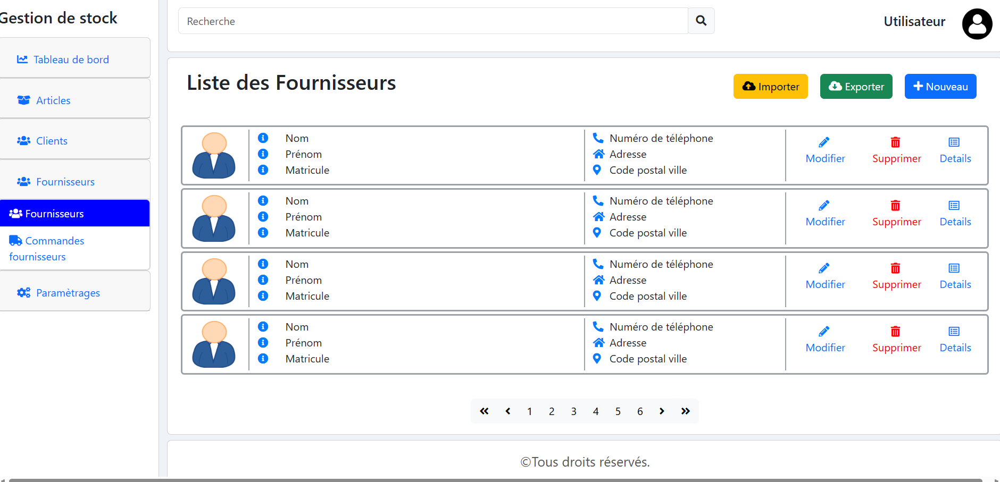
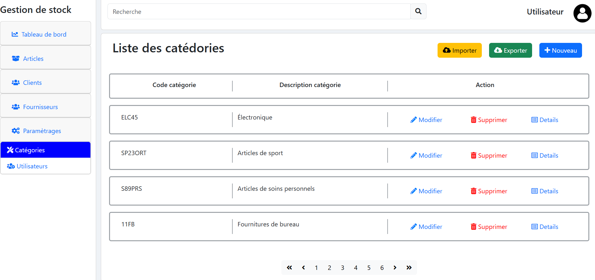

# 📦 Système de Gestion de Stock (GDS)


## 📋 Description

Application web complète de gestion de stock développée avec **Angular**. Cette solution permet aux entreprises de gérer efficacement leurs articles, catégories, clients, fournisseurs, commandes et mouvements de stock à travers une interface moderne et intuitive.

Le système offre un tableau de bord avec statistiques visuelles, une gestion des utilisateurs avec authentification sécurisée, et des fonctionnalités avancées de suivi des stocks en temps réel.

---

## ✨ Fonctionnalités Principales

### 📊 **Tableau de Bord**
- Vue d'ensemble avec statistiques en temps réel
- Graphiques interactifs (graphiques en barres et linéaires)


### 📦 **Gestion des Articles**
- Création, modification et suppression d'articles
- Gestion des codes articles et désignations


### 🏷️ **Gestion des Catégories**
- Codes catégories personnalisables
- Descriptions détaillées
- Actions CRUD complètes


### 👥 **Gestion des Clients**
- Fiches clients complètes
- Coordonnées et informations de contact


### 🏭 **Gestion des Fournisseurs**
- Base de données fournisseurs
- Informations de contact détaillées
- Suivi des commandes fournisseurs

### 🛒 **Gestion des Commandes**
- Commandes clients et fournisseurs
- Détails des commandes avec articles multiples
- Calcul des totaux 

### 📈 **Mouvements de Stock**
- Historique complet des mouvements
- Types de mouvements (Entrée/Sortie)
- Traçabilité par date et quantité
- Lien avec les commandes

### 👤 **Gestion des Utilisateurs**
- Inscription et connexion
- Changement de mot de passe


---

## 🛠️ Technologies Utilisées

### Frontend
- **Angular** - Framework principal
- **TypeScript** - Langage de programmation
- **HTML5 & CSS3** - Structure et style
- **Bootstrap 5** - Framework CSS responsive
- **Font Awesome** - Icônes

### Outils de Développement
- **Angular CLI** - Outils de développement
- **RxJS** - Programmation réactive
- **Chart.js** - Graphiques et visualisations


---

## 🚀 Installation et Lancement

### Prérequis
- Node.js (v16 ou v18 recommandé)
- npm ou yarn
- Angular CLI

### Installation

```bash

# Installer les dépendances
npm install

# Lancer le serveur de développement
ng serve --open
```

---

## 📸 Captures d'Écran

### Tableau de Bord
Interfaces principales avec statistiques et graphiques en temps réel.



### Gestion des Articles
Liste complète des articles avec actions CRUD.



### Gestion des Commandes
Système d'accordion pour visualiser les détails des commandes clients/fournisseurs.




### Mouvements de Stock
Suivi détaillé des entrées et sorties de stock avec historique complet.


### Gestion des fournisseurs 


### Gestion des catégories 



---

## 🎯 Fonctionnalités Clés

### ✅ CRUD Complet
- **C**reate : Création de nouveaux enregistrements
- **R**ead : Consultation et recherche
- **U**pdate : Modification des données
- **D**elete : Suppression sécurisée


---

## 👨‍💻 Auteur

**Wiem HAMMAMI**
- Portfolio: [wiem-hammami-portfolio.vercel.app](https://wiem-hammami-porftolio.vercel.app/)
- LinkedIn: [linkedin.com/in/wiem-hammami](https://linkedin.com/in/wiem-hammami-16aa26254/)
- GitHub: [@WiemHammemi](https://github.com/WiemHammemi)
- Email: wiiem.hammami@gmail.com

